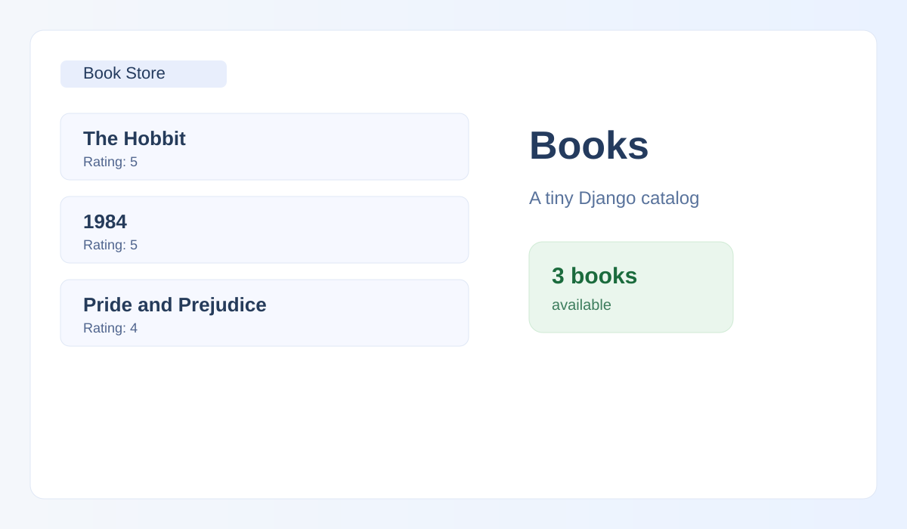
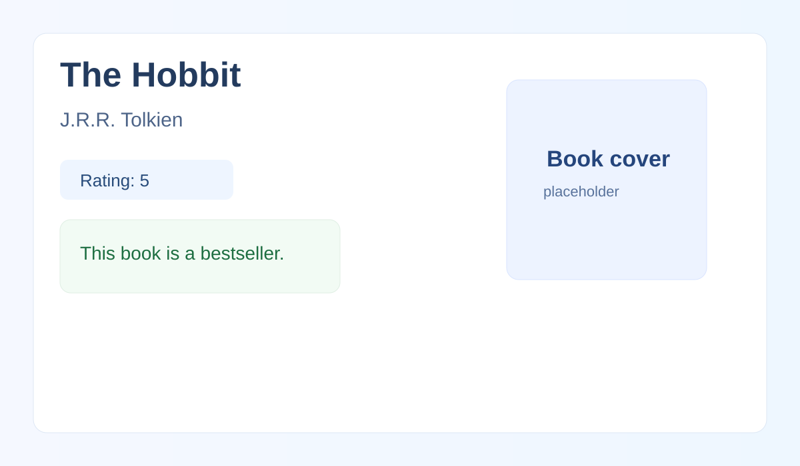

# Book Store

A small Django project for managing and displaying a collection of books. It includes a homepage with all books, a detail page for each book, and slug-based URLs for cleaner navigation.

## Features

- View all books on the home page
- Open a detail page for each book
- Display book title, author, rating, and bestseller status
- Use slug-based URLs like `/the-hobbit`
- Basic Django test coverage for the detail page

## Tech Stack

- Python
- Django 6.1.1
- SQLite database

## Project Structure

```text
book_store/
├── .gitignore
├── README.md
├── bookstore/
│   ├── manage.py
│   ├── bookstore/
│   │   ├── __init__.py
│   │   ├── asgi.py
│   │   ├── settings.py
│   │   ├── urls.py
│   │   └── wsgi.py
│   └── book_outlet/
│       ├── __init__.py
│       ├── admin.py
│       ├── apps.py
│       ├── migrations/
│       ├── models.py
│       ├── templates/
│       ├── tests.py
│       ├── urls.py
│       └── views.py
└── db.sqlite3
```

## Getting Started

1. Clone the repository:

```bash
git clone https://github.com/dalteg/bookstore.git
cd bookstore
```

2. Create and activate a virtual environment:

```bash
python -m venv venv
# Windows
venv\Scripts\activate
# macOS/Linux
source venv/bin/activate
```

3. Install dependencies:

```bash
pip install django
```

4. Run the app:

```bash
cd bookstore
python manage.py migrate
python manage.py runserver
```

5. Open the app in your browser:

```text
http://127.0.0.1:8000/
```

## Screenshots

### Book list page



### Book detail page



> Replace these SVG placeholders with real screenshots when you want a more polished project presentation.

## Run Tests

```bash
cd bookstore
python manage.py test book_outlet
```

## License

This project is for learning and demonstration purposes.
